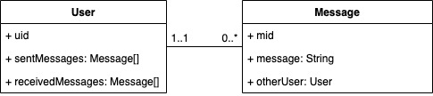

# Designing RESTful Web Service APIs
## Designing the Follows RESTful Web Service API
### 1. User follows another user
* Analysis: When User A follows User B, there will be a new record in the database, so this is a "create" operation (POST). 
User B will be found in User A's following list, and User A will be found in User B's follower list.
* HTTP method: POST
* Path: ```/api/users/:uida/follows/:uidb```
* Request: User A's PK (who sends the request) and User B's PK (who will be followed)
* Response: New follows JSON

### 2. User unfollows another user
* Analysis: When User A unfollows User B, the previous following relationship is no longer
valid, and the previous record will be removed from database, so this is a "delete" operation
  (DELETE).
* HTTP method: DELETE
* Path: ```/api/users/:uida/follows/:uidb```
* Request: User A's PK (who sends the request) and User B's PK (who will be unfollowed)
* Response: Delete status

### 3. User views a list of other users they are following
* Analysis: User retrieves a list of other users he/she is following, which is a 
"read/retrieve" operation (GET). There will be no data change.
* HTTP method: GET
* Path: ```/api/users/:uid/follows```
* Request: User's PK
* Response: User JSON array (all users followed by the request sender)

### 4. User views a list of other users that are following them
* Analysis: User retrieves a list of his/her followers, which is a "read/retrieve"
operation (GET). There will be no data change.
* HTTP method: GET
* Path: ```/api/follows/:uid```
* Request: User's PK
* Response: User JSON array (all users following the request sender)

### 5. (Extra) Deletes all following relationships
* Analysis: Removes all "User A follows User B" relationships, which would be useful
  when debugging or testing. This is a "delete" operation (DELETE).
* HTTP method: DELETE
* Path: ```/api/follows```
* Request: None
* Response: Delete status

### 6. (Extra) Retrieves all following relationships
* Analysis: Retrieves all "User A follows User B" relationships, which would be useful
when debugging or testing. This is a "read/retrieve" operation (GET). There is no data change.
* HTTP method: GET
* Path: ```/api/follows```
* Request: None
* Response: All following relationships in JSON array

## Design the Bookmarks RESTful Web Service API
### 1. User bookmarks a tuit:
* Analysis: When a user bookmarks a tuit, there will be a new record in database to reflect the 
action. So this would be a "create" operation (POST).
* HTTP method: POST
* Path: ```/api/users/:uid/bookmarks/:tid```
* Request: User's PK and the tuit's PK
* Response: New bookmarks JSON

### 2. User unbookmarks a tuit
* Analysis: When a user unbookmarks a tuit, the previous record should be removed from the
database, which is a "delete" operation (DELETE).
* HTTP method: DELETE
* Path: ```/api/users/:uid/bookmarks/:tid```
* Request: User's PK and the tuit's PK
* Response: Delete status

### 3. User views a list of tuits they have bookmarked
* Analysis: When a user views a list of his/her bookmarked tuits, the data will be retrieved 
from the database, which is a "read/retrieve" operation (GET). No data change.
* HTTP method: GET
* Path: ```/api/users/:uid/bookmarks```
* Request: User's PK
* Response: Bookmarked Tuit JSON array

### 4. (Extra) User views a list of users who bookmarked a certain tuit
* Analysis: Viewing a list of users who bookmarked a tuit will read data from the 
database, which is a "read/retrieve" operation (GET). No data change.
* HTTP method: GET
* Path: ```/api/bookmarks/:tid```
* Request: Tuit's PK
* Response: User JSON array (all users who bookmarked the tuit)

### 5. (Extra) Retrieve all user's bookmarked tuits
* Analysis: Retrieving all bookmarked tuits to show all relationships, which would be
a "read/retrieve" operation (GET). Might be useful when debugging and testing.
* HTTP method: GET
* Path: ```/api/bookmarks```
* Request: None
* Response: A nested JSON array that include all bookmarked tuits of each user.

## Design the Messages RESTful Web Service API
### 1. User sends a message to another user
* Analysis: When User A sends a message to User B, there will be a new record in the database to
reflect the action, which will be a "create" operation (POST).
* HTTP method: POST
* Path: ```/api/users/:uida/messages/:uidb```
* Request: User A's PK (sender), User B's PK (receiver), and message in the body
* Response: New message JSON with message's PK

### 2. User views a list of messages they have sent
* Analysis: When a user views a list of sent messages, the data will be retrieved from the database,
which is a "read/retrieve" operation (GET). No data change.
* HTTP method: GET
* Path: ```/api/users/:uid/messages```
* Request: User's PK
* Response: Message JSON array (all sent messages, not to a specific user)

### 3. User views a list of messages sent to them
* Analysis: When a user views a list of received messages, the data will be retrieved from the database,
  which is a "read/retrieve" operation (GET). No data change.
* HTTP method: GET
* Path: ```/api/messages/:uid```
* Request: User's PK
* Response: Message JSON array (all messages that are sent to the user)

### 4. User deletes a message
* Analysis: When a user deletes a message, the record should be removed from the database, which is
a "delete" operation (DELETE). Assuming each message is assigned with a unique ID (PK).
* HTTP method: DELETE
* Path: ```/api/messages/:mid```
* Request: Message's PK
* Response: Delete status

### 5. (Extra) User A deletes all messages sent from User A to User B
* Analysis: User A can delete all messages that he/she sent to User B, which will remove all related records
from the database. So this is a "delete" operation.
* HTTP method: DELETE
* Path: ```/api/users/:uida/messages/:uidb```
* Request: User A's PK (sender) and User B's PK (receiver)
* Response: Delete status

### 6. (Extra) Retrieves all messages
* Analysis: Retrieves all the messages in the database, which would be useful when debugging or
testing. This is a "read/retrieve" operation (GET). There is no data change.
* HTTP method: GET
* Path: ```/api/messages```
* Request: None
* Response: Message JSON array

# Implementing RESTful Web Service APIs
## Implement the Follows RESTful Web Service
### 1. Add a "follower" field to the User class

* Pros:
  * Easy to retrieve, add, or delete a user's followers
  * No need to keep track of multiple instances to maintain consistency
    (when User A unfollows User B, simply remove User A from User B's follower array)
  * Doable in MongoDB
* Cons:
  * Hard to retrieve the users followed by User A, which requires a full scan on the
    database records to find all the users whose "follower" field has User A.
  * Impossible in relational database

### 2. Add "follower" and "following" fields to the User class

* Pros:
  * Easy to retrieve each user's followers and followings data
  * Doable in MongoDB
* Cons:
  * Need to make multiple requests to maintain consistency. For example, when User A
    follows User B, we need to 1) add User A to User B's follower array, then 2) add User B
    to User A's following array. Unfollow action will have similar trouble.
  * Impossible in relational database

### 3. Have a mapping table to keep track of following relationships

* Pros:
  * Easy to maintain consistency since every relationship has only one record.
  * Doable in both relational database and MongoDB
* Cons:
  * Cannot retrieve followings and followers data without join operation

## Decision
I would go with **option 3**, since this option is much easier to maintain consistency: only 1 request is needed
for creating/deleting a following relationship. Although it needs a bit of effort to retrieve followings or followers
data, MongoDB's index technique can help speed up the process.

## Implement Bookmarks RESTful Web Service API
### 1. Add "bookmarkedTuit" field to the User class

* Pros:
  * Easy to maintain consistency
  * Easy to retrieve, add, and delete bookmarked tuit
  * Doable in MongoDB
* Cons:
  * Hard to retrieve all the users that bookmarked a certain tuit
  * Impossible in relational database

### 2. Add "bookmarkedTuit" field to the User class and "bookmarkedBy" field to the Tuit class

* Pros:
  * Easy to retrieve a user's bookmarked tuits and also the users who bookmarked a certain
    tuit
  * Doable in MongoDB
* Cons:
  * Hard to maintain consistency. When a user bookmarks a tuit, we need to add the tuit to the user's
    bookmarkedTuit array and also add the user to the tuit's bookmarkedBy array.
  * Impossible in relational database

### 3. Have a mapping table to keep track of bookmarking relationships

* Pros:
  * Easy to maintain consistency
  * Easy to read, add, and delete bookmarking relationships
  * Doable in both relational database and MongoDB
* Cons:
  * Need effort to retrieve filtered results: a user's bookmarked tuits, or all
    users that like a certain tuit

## Decision
I would go with **option 3** since that's the easiest way to maintain consistency. There is only one
record in the database that is involved with one bookmarking relationship. No need to update data in multiple places.
MongoDB's index technique can help retrieve filtered results.

## Implement the Messages RESTful Web Service API
### 1. Add "sentMessages" field to the user class

* Pros:
  * Easy to maintain consistency
  * Easy to read, add, and delete sent messages
  * Doable in MongoDB
* Cons:
  * Hard to retrieve "received messages" since it needs a full scan on the database records
  * Impossible in relational database

### 2. Add "sentMessages" and "receivedMessages" fields to the user class

* Pros:
  * Easy to read "sentMessages" and "receivedMessages"
  * Doable in MongoDB
* Cons:
  * Hard to maintain consistency. Sending a new message from User A to User B will require data
    update in both User A's "sentMessages" field and User B's "receivedMessages" fields.
  * Impossible in relational database

### 3. Have a mapping table to keep track of message sending and receiving

* Pros:
  * Easy to maintain consistency
  * Doable in both relational database and MongoDB
* Cons:
  * Need effort to retrieve filtered results: all messages sent to User A, or all messages sent from
    User A

## Decision
I would go with **option 3** since it's the easiest way to maintain consistency. There is only one database record
that is involved with each sent message, so no need to update data in multiple places per request. MongonDB's index
technique can help retrieve the filtered results.
